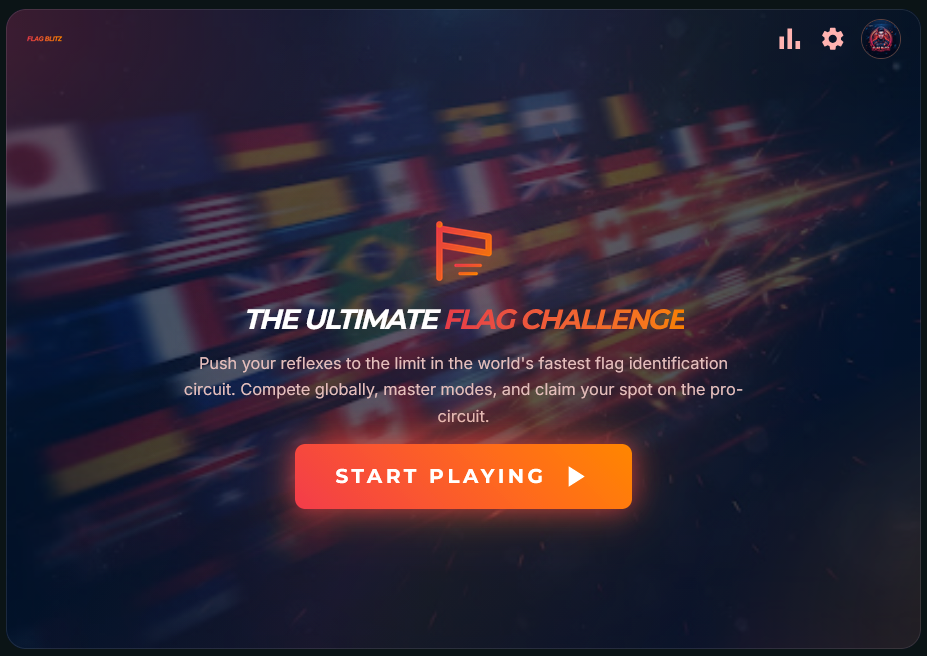

# Flag Blitz

<p align="center">
  
</p>



**Flag Blitz** is a fast-paced flag identification game built for Reddit with [Devvit](https://developers.reddit.com/). Players race through world flags inside a subreddit post — no external site or download required.

**Repo:** https://github.com/vladifel/flag-blitz  
**App:** https://developers.reddit.com/apps/flag-blitz  
**Playtest:** `r/flag_blitz_dev`

## What this app does

Flag Blitz adds an interactive game post to a subreddit. Each post embeds the full game inline. Players can:

- **Quick / Standard / Pro / Marathon** — timed flag quizzes of increasing length
- **Sudden Death** — one wrong answer ends the run
- **Leaderboards** — compete on global rankings per mode

Scores are stored per Reddit user via Devvit Redis.

## How to start playing (for reviewers)

1. **Install** the app on a test subreddit (or open an existing Flag Blitz post).
2. **Open a Flag Blitz post** in the feed or post detail page.
3. The **landing screen loads inline** — tap **START PLAYING**.
4. Pick a mode, then identify each flag from the multiple-choice options.
5. Optional: open **leaderboard** or **settings** from the top bar.

### For moderators setting up the app

1. Install **Flag Blitz** on your subreddit.
2. Use the subreddit menu: **Create Flag Blitz Post** to publish a game post.
3. After each app upload, create a **new** post so players get the latest bundle.

### Playtest link

`https://www.reddit.com/r/flag_blitz_dev/?playtest=flag-blitz`

## Game Modes

- **Quick** — 25 flags
- **Standard** — 50 flags
- **Pro** — 100 flags
- **Marathon** — 230 flags
- **Sudden Death** — one wrong answer ends the run

Score formula: `(correctAnswers × 1,000,000) − timeInSeconds`

## Stack

- **Client:** React 19, Tailwind CSS 4, Vite — rendered inline in Reddit (`game.html`)
- **Server:** Hono on `@devvit/web/server` — scores, leaderboards, flag proxy
- **Data:** 230 countries in `src/shared/countries.ts`; flags bundled under `public/flags/`
- **Leaderboards:** Redis sorted sets (`leaderboard:25`, `leaderboard:50`, …)

## Development

```bash
npm install
npm run download-flags   # caches FlagCDN PNGs into assets/ + public/
npm run build
npm run upload           # build + upload to Devvit
npm run dev              # build then playtest
```

## Project layout

```
src/client/     React UI (screens, chrome, icons, assets)
src/server/     Hono API + menu post creation
src/shared/     Game logic, countries, leaderboard helpers
public/flags/   Bundled country flag PNGs
docs/           Screenshot, privacy policy, terms
```

## Privacy & Terms

- [Privacy Policy](https://vladifel.github.io/flag-blitz/privacy-policy.html)
- [Terms and Conditions](https://vladifel.github.io/flag-blitz/terms-and-conditions.html)

## License

BSD-3-Clause
